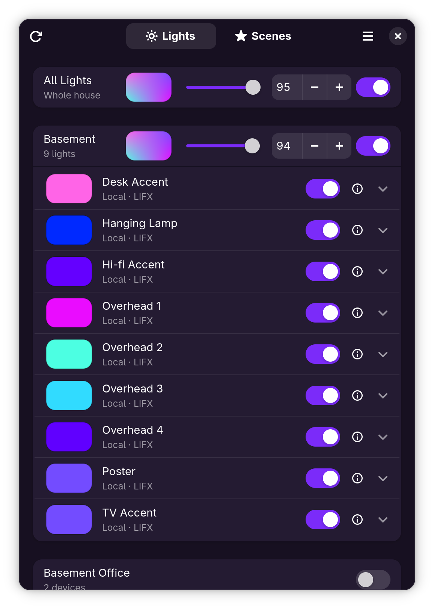
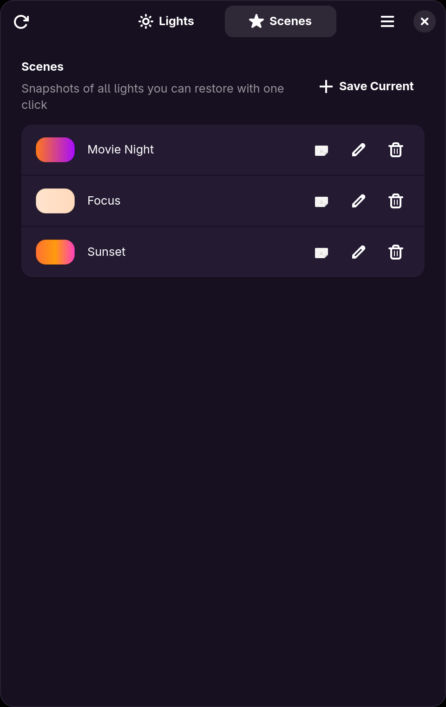

# Luxel

A native GNOME app (Rust + GTK4 + libadwaita) for controlling LIFX smart bulbs
from the Linux desktop — no phone required.

<p align="center">
  
  
</p>

## Features

- **Local control, no cloud needed** — bulbs are discovered directly on your
  Wi-Fi/LAN using the LIFX UDP protocol (port 56700) and controlled with
  millisecond latency.
- **Isolated IoT networks supported** — if your bulbs live on a separate
  subnet/VLAN where broadcast discovery can't reach them, list their subnets
  in Settings (e.g. `192.168.20.0/24`). Each configured subnet gets a
  directed-broadcast probe plus a unicast sweep of every host address (up to
  a /22), which routes across VLANs. Your router's firewall must allow
  traffic from this machine to the IoT network on UDP port 56700.
- **Optional LIFX Cloud support** — add a personal access token
  (from <https://cloud.lifx.com/settings>) in Settings to list and control
  lights through the cloud, e.g. when you're on a different network. When a
  bulb is reachable both ways, local control is always preferred.
- **Rooms** — bulbs are grouped into room sections (from their LIFX group by
  default; assign any bulb to a different or new room from its Room field).
  Every room header has a color button (wheel + warmth popover), power
  switch, and brightness slider, and an "All Lights" row applies the same
  controls to the whole house at once.
- **SmartLife/Tuya smart plugs** — plugs that use the Tuya local protocol
  (SmartLife app) are controlled locally over TCP port 6668, including
  across subnets/VLANs. Tuya encrypts local control with a per-device
  *local key* that has to be fetched once from the Tuya cloud; the
  built-in **SmartLife Setup wizard** (in Settings) walks through the whole
  process — Tuya developer account, linking the SmartLife app, then
  fetching every device's ID and local key straight from the Tuya Cloud
  API in-app (no terminal needed; importing a
  [tinytuya](https://github.com/jasonacox/tinytuya) `devices.json` remains
  as a fallback) and locating the devices on your network automatically
  (each device is identified by its own key, so the scan works across
  routed subnets where broadcasts can't). Protocol versions 3.3, 3.4 and
  3.5 are supported with automatic detection. Plugs show a power switch
  (no color controls), join rooms and scenes, and count into the room and
  All Lights switches. Devices can also be entered by hand in
  Settings.
- **Scenes** — save the current state of your lights under a name and restore
  it with one click, choosing exactly which lights each scene includes.
  Scenes are stored locally, so they work without any cloud account.
- Per-bulb power switch, brightness slider, and a Colors/Whites mode toggle:
  Colors shows a LIFX-style hue/saturation wheel (white center, colors toward
  the rim) plus an RGB hex entry (`#RRGGBB`); Whites shows a color-temperature
  (warmth) slider with a typed kelvin entry (1500–9000 K) and the live LIFX
  shade name (Incandescent, Daylight, …). Live state polling means external
  changes (app, physical switch) show up automatically.
- Bulbs go insensitive when unreachable.

## Controls

| Action | Shortcut |
| --- | --- |
| Rescan for lights | Ctrl+R |
| Settings | Ctrl+, |
| Keyboard shortcuts | Ctrl+? |
| Quit | Ctrl+Q |

## Building

### Development build

Requires `gtk4-devel` and `libadwaita-devel` (Fedora) or equivalent.

```sh
cargo run
```

### Flatpak

Requires the GNOME 50 SDK and the Rust extension:

```sh
flatpak install flathub org.gnome.Platform//50 org.gnome.Sdk//50 \
    org.freedesktop.Sdk.Extension.rust-stable//25.08
```

Then build and install:

```sh
flatpak-builder --user --install --force-clean build \
    build-aux/io.github.hyprlab.Luxel.json
flatpak run io.github.hyprlab.Luxel
```

The flatpak builds offline from vendored crate sources. After changing
dependencies in `Cargo.toml`, regenerate the list with:

```sh
./build-aux/regenerate-cargo-sources.sh
```

## Sandbox permissions

- `--share=network` — required both for LAN UDP discovery/control and for the
  optional cloud API.
- Wayland (with X11 fallback) and DRI for rendering.

Nothing else: no host filesystem access. The cloud token is stored in the
app's sandboxed config directory
(`~/.var/app/io.github.hyprlab.Luxel/config/luxel/config.json`).

## Architecture

- `src/lan.rs` — background thread speaking the LIFX LAN protocol over UDP
  ([lifx-core](https://crates.io/crates/lifx-core)): broadcast discovery every
  10 s, state polling every 3 s, set-power/set-color commands.
- `src/cloud.rs` — background thread for the LIFX HTTP API (`api.lifx.com/v1`).
- `src/ui/` — libadwaita UI. Both backends report bulbs keyed by serial
  number, so a bulb seen by both is merged into a single row; commands route
  to the LAN when the bulb is locally reachable, falling back to the cloud.

## AI notice

Luxel is built by a human maintainer working with generative AI as a development tool:

- **Code** — the large majority of the Rust code in this repository was written with Anthropic's Claude (via Claude Code), working from the maintainer's direction. The maintainer decides what gets built, reviews the results, tests every release, and signs off on everything that ships.
- **Text** — documentation, release notes, and in-app copy are largely AI-drafted and human-edited.
- **The app itself contains no AI.** Luxel has no AI features and makes no requests to AI services — it talks only to your lights and smart plugs on your local network (plus the optional LIFX/Tuya cloud endpoints you configure). AI was used to *build* the app, not to run it.

Bug reports and pull requests are welcome from humans and their AI tools alike; everything merged gets the same human review.

## License

AGPL-3.0-or-later
